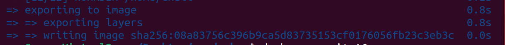

# Docker\_Build

* 도커 엔진 설치가 완료 된 후 개발환경 설정을 위해 도커 이미지를 빌드하는 과정을 설명한다.

## 도커 빌드



### 준비

* Dockerfile과 deploy 파일을 한 디렉토리(폴더)에 모아 둔다.
  * 참조: [Docker file](/broken/pages/37232ddec1f97defb087df92df0626ad29ed291a)



### 빌드

* Dockerfile이 위치한 디렉토리에서 아래 명령어를 실행한다.

```shell
docker build .
```






### 확인

* 빌드 완료 후 `docker images` 명령어로 생성된 이미지를 확인할 수 있다.


