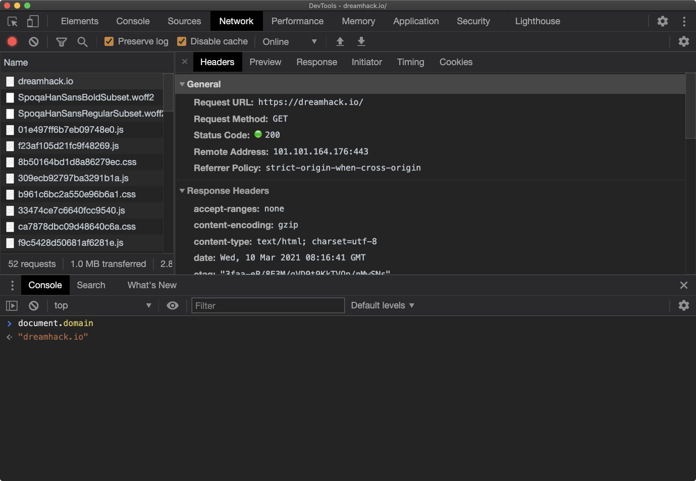

# Console

\*\*콘솔(Console)\*\*은 프론트엔드의 자바스크립트 코드에서 발생한 각종 메세지를 출력하고, 이용자가 입력한 자바스크립트 코드를 실행도 해주는 도구입니다.

자바스크립트로 웹 개발을 할 때, `console` 오브젝트에는 개발자 도구의 콘솔에 접근할 수 있는 함수가 정의되어 있습니다. 코드를 작성하면서 어떤 변수의 값을 중간에 출력해보고 싶다면, `console.log` 등을 유용하게 사용할 수 있습니다.

NodeJS의 console 오브젝트 예시:

```
> console
Console {
  log: [Function: bound consoleCall],
  debug: [Function: bound consoleCall],
  info: [Function: bound consoleCall],
  dirxml: [Function: bound consoleCall],
  warn: [Function: bound consoleCall],
  error: [Function: bound consoleCall],
  ...
  context: [Function: context],
  [Symbol(counts)]: Map {},
  [Symbol(kColorMode)]: 'auto' }
```


단축키

* Windows/Linux: Ctrl + Shift + J
* macOS: Option(⌥) + Cmd(⌘) + J


콘솔을 사용하면 브라우저에서 자바스크립트를 실행하고 결과를 확인할 수 있습니다. 단축키로 콘솔을 열고, 아래 내용을 콘솔에 입력해보세요.


```javascript
// "hello" 문자열을 출력하는 alert 함수를 실행합니다.
alert("hello");

// prompt는 popup box로 이용자 입력을 받는 함수입니다.
// 이용자가 입력한 데이터는 return value로 설정됩니다.
var value = prompt('input')

// confirm 는 확인/취소(yes/no)를 확인하는 이용자로부터 입력 받는 함수입니다.
// 이용자의 선택에 따라 Boolean(true/false)타입의 return value를 가집니다.
var true_false = confirm('yes or no ?');

// document.body를 변경합니다.
document.body.innerHTML = '<h1>Refresh!</h1>';

// document.body에 새로운 html 코드를 추가합니다.
document.body.innerHTML += '<h1>HI!</h1>';
```


## Console Drawer

개발자 도구에 새로운 콘솔창을 열어 가시성과 효율성을 높일 수 있습니다. 다음과 같이 네트워크 패널과 콘솔 패널을 동시에 사용할 수도 있습니다.


단축키

* Windows, macOS: ESC



