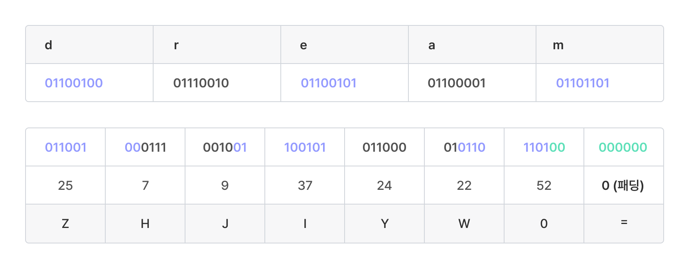

# Base64

Base64 인코딩은 이진 데이터를 아스키 문자로 구성된 텍스트로 변환하는 인코딩 방식입니다. 총 64개의 아스키 문자가 인코딩에 사용되기 때문에 64진법(Base 64)이라는 의미에서 이러한 이름이 붙여졌습니다. 64개의 아스키 문자는 알파벳 대소문자(52자), 숫자(10자), +, / 입니다.

코드(문자 목록):

```
ABCDEFGHIJKLMNOPQRSTUVWXYZabcdefghijklmnopqrstuvwxyz0123456789+/
```

Base64 인코딩은 이진 데이터를 그대로 포함할 수 없이 텍스트만 허용되는 환경에서 이진 데이터를 텍스트 형식으로 나타내기 위해 사용합니다. 예를 들어, 이진 데이터인 이미지를 HTML 파일에 넣는 경우 base64로 인코딩해 넣을 수 있습니다.

Base64 인코딩 방식은 다음과 같습니다.



### 원본 비트 묶음화

원본 이진 데이터를 비트 나열로 표현하고, 이를 6비트씩 끊어서 묶습니다.\
만약 비트의 개수가 6의 배수가 아닐 경우, 0을 뒤에 추가하여 6의 배수로 만듭니다.



### 인덱스 변환 및 문자 치환

각 6비트 묶음을 수로 변환한 뒤, [base64 테이블](https://www.garykessler.net/library/base64.html)에서 해당하는 문자를 찾아 이로 치환합니다.



### 패딩 추가

치환 과정을 거친 뒤, 글자 수가 4의 배수가 되도록 문자 '='를 반복해 뒤에 추가합니다. 이를 패딩(Padding)이라고 합니다.



<details>

<summary>패딩을 왜 넣어야 하나요?</summary>

예를 들어 여러분이 `ZA` 라는 두 글자를 디코딩하게 되면, `011001 000000` 이라는 12개의 비트 나열로 바뀌게 되고, 이를 앞에서 8개씩 끊어 읽으면 아스키 문자 ‘d' (`01100100`) 이후 `0000` 이 남게 됩니다. 이 경우 디코딩을 하는 입장에서 뒤에 추가적인 내용이 있는데 오지 않은 것인지, 아니면 여기서 디코딩을 끝내는 것이 맞는지 알 수 없게 됩니다.

그러므로 총 비트의 개수가 8의 배수가 되게끔 패딩 문자 '='를 뒤에 붙여 이를 명확하게 하는 것입니다.

</details>

아래 예시는 문자열 `dream`을 [base64 인코딩](https://tools.dreamhack.games/cyberchef)한 결과입니다. 인코딩 결과는 `ZHJlYW0=`입니다.

Base64 인코딩 예시


