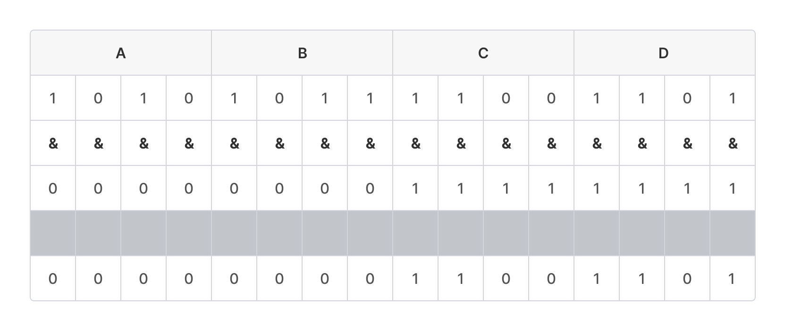

# bit\_operation

피연산자를 2진수로 표현하여 비트(bit) 단위로 연산하는 것을 비트 연산이라고 한다.\
비트 단위로 논리 연산을 수행하거나, 비트를 특정 값만큼 이동하는 시프트(shift) 연산을 수행한다.

## 논리 연산

| **논리 연산자** | **설명**                           |
| ---------- | -------------------------------- |
| x **\|** y | 둘 중 하나라도 참이면 결과는 참입니다. (OR)      |
| x **&&** y | 둘 다 참이면 결과는 참입니다. (AND)          |
| \*\*!\*\*x | 참이면 결과는 거짓, 거짓이면 결과는 참입니다. (NOT) |

## 비트 연산자

| **비트 연산자**   | **설명**                                          |
| ------------ | ----------------------------------------------- |
| x **\|** y   | 두 비트 중 하나라도 1이면 결과는 1입니다. (OR)                  |
| x **&** y    | 두 비트 모두 1이면 결과는 1입니다. (AND)                     |
| x **^** y    | 두 비트가 같으면 결과는 0, 다르면 결과는 1입니다. (XOR)            |
| **\~**&#x78; | 비트가 0이면 결과는 1, 1이면 결과는 0으로 모든 비트를 반전시킵니다. (NOT) |

## 시프트 연산자

| **시프트 연산자**                                 | **설명**               |
| ------------------------------------------- | -------------------- |
| x **<<** n                                  | 비트를 n만큼 왼쪽으로 이동합니다.  |
| 오른쪽 빈 칸은 모두 0으로 채웁니다.                       |                      |
| == **x \* 2n**                              |                      |
| x **>>** n (산술 시프트)                         | 비트를 n만큼 오른쪽으로 이동합니다. |
| 왼쪽 빈 칸은 가장 왼쪽에 있던 비트(MSB)와 동일한 비트 값으로 채웁니다. |                      |
| (양수는 양수, 음수는 음수로 부호가 유지됩니다.)                |                      |
| == **x / 2n**                               |                      |
| x **>>>** n (논리 시프트)                        | 비트를 n만큼 오른쪽으로 이동합니다. |
| 왼쪽 빈 칸은 모두 0으로 채웁니다.                        |                      |
| (음수는 부호가 유지되지 않습니다.)                        |                      |

## 비트 연산자 활용

### AND (&) 연산을 활용한 비트 마스킹

어떤 데이터가 존재할 때, 특정 위치의 비트만 표시하거나 가리는 연산을 비트 마스킹(Bit Masking)이라고 부른다. AND 연산은 대응하는 비트가 모두 1이어야 1이 되므로, 원하는 위치만 1로 만들어 마스크를 적용하면 해당 위치의 값만 남기거나 지울 수 있다.

예: 2바이트 크기의 데이터 0xABCD에서 상위 8비트(0xAB)를 없애고 하위 8비트(0xCD)만 남기려면 0xABCD & 0x00FF를 수행한다.



16진수 F(1111)는 특정 값과 AND 연산하면 해당 비트가 유지되고, 0(0000)은 해당 비트를 0으로 만든다. 따라서 상위 바이트는 0이 되고 하위 바이트만 남아 0xCD가 된다.

### AND (&) 연산과 시프트 연산을 활용하여 특정 비트/바이트 가져오기

32비트(4바이트) 데이터 0x12345678 (0001 0010 0011 0100 0101 0110 0111 1000)에서 특정 비트만 가져오는 예:

* 하위 1바이트만 가져오기: 0x000000FF와 AND 연산

```
0x12345678 & 0x000000FF = 0x00000078
(0000 0000 0000 0000 0000 0000 0111 1000)
```


* 상위 1바이트만 가져오기: 24번 우측으로 논리 시프트하거나, 산술 시프트 후 0x000000FF와 AND

```
0x12345678 >>> 24 = 0x00000012
(0000 0000 0000 0000 0000 0000 0001 0010)

0x12345678 >> 24 & 0x000000FF = 0x00000012
(0000 0000 0000 0000 0000 0000 0001 0010)
```


* 상위에서 두 번째 바이트 가져오기: 16번 우측으로 시프트 후 0x000000FF와 AND

```
0x12345678 >> 16 & 0x000000FF = 0x00000034
(0000 0000 0000 0000 0000 0000 0011 0100)
```


* 하위 1바이트의 상위 4비트 가져오기: 4번 우측으로 시프트한 후 0x0000000F와 AND

```
0x12345678 >> 4 & 0x0000000F = 0x00000007
(0000 0000 0000 0000 0000 0000 0000 0111)
```


### XOR 연산을 활용한 비교와 암호화

XOR 연산은 비트 값이 같으면 0을 반환한다. 자기 자신과 XOR 연산하면 결과는 0이 된다. 따라서 두 변수의 값을 XOR하여 결과가 0인지 확인하면 두 값이 같은지 비교할 수 있다.

또한 같은 값에 어떤 값을 두 번 XOR하면 원래 값으로 돌아온다. 예: z = x ^ y 라면 z ^ y = x ^ y ^ y = x. 이 특성을 이용하면 y를 key로 간단한 암호화/복호화에 활용할 수 있다.

XOR 연산은 이러한 특성 때문에 어셈블리 코드나 암호 기법에서 자주 사용된다.

### 시프트 연산을 활용한 곱셈, 나눗셈

시프트 연산은 2^n을 곱하거나 나눈 결과와 동일하다. 따라서 곱셈이나 나눗셈 연산자 대신 시프트 연산자를 사용하여 간단한 산술 연산을 수행할 수 있다. 시프트 연산은 비트 레벨에서 연산하므로 특정 상황에서 더 효율적이고 빠를 수 있다.
