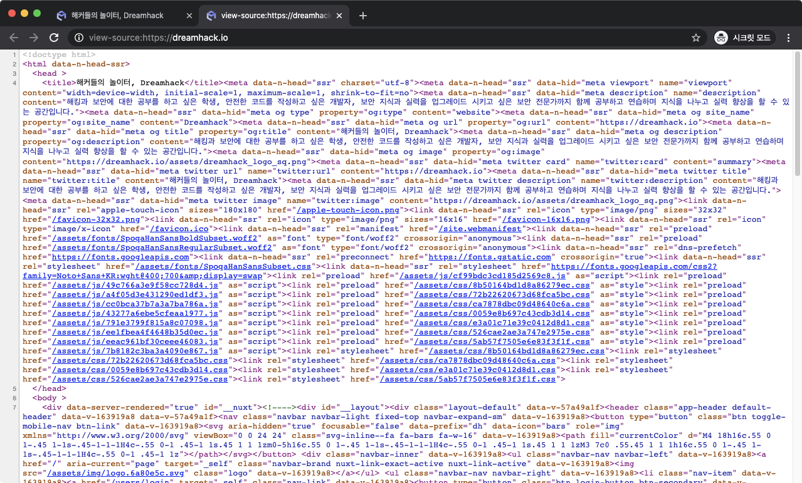

# BrowserDevTools

* 잦은 코드 수정으로 렌더링 결과를 자주 확인해야 함으로 브라우저에서 자체적으로 개발자 도구(Devtools)를 지원하여 불편함을 줄였다.
* HTML, CSS 코드를 브라우저에서 수정하고 결과를 바로 확인할 수 있으며, 자바스크립트 코드를 대상으로 디버거도 제공한다.
* 서버와 오가는 HTTP 패킷도 상세히 보여주므로 프로토콜 상에서 발생하는 문제도 쉽게 발견할 수 있다.
* 웹 서비스를 진단하는 도구인 만큼, 웹 취약점을 이용하는 공격자에게도 유용하다.

## 개발자 도구

F12를 눌러 개발자 툴을 활성화 할 수 있다.

| 🔴 빨간색 | [요소 검사(Inspect)](/broken/pages/512ec0e14cdac05af4e6b6713bdfd00f6642f2aa) 및 [디바이스 툴바(Device Toolbar)](/broken/pages/b76b5429d49c714e8068ba61a7be2c7656389a8d)                                                                                                                                                                                                                                                                                                                                                                                                                                                                                                                                                        |
| ------ | ------------------------------------------------------------------------------------------------------------------------------------------------------------------------------------------------------------------------------------------------------------------------------------------------------------------------------------------------------------------------------------------------------------------------------------------------------------------------------------------------------------------------------------------------------------------------------------------------------------------------------------------------------------------------------------------------------------------- |
| 🟠 주황색 | 
기능을 선택하는 패널.  - <a href="/broken/pages/0789647fdcb3b963723e6cbc7970591c6bccc78c"><strong>Elements</strong></a>: 페이지를 구성하는 HTML 검사  - <a href="file:///0903665/linux_admin/Console.md"><strong>Console</strong></a>: 자바 스크립트를 실행하고 결과를 확인할 수 있음  - <a href="file:///0903665/misc/Sources.md"><strong>Sources</strong></a>: HTML, CSS, JS 등 페이지를 구성하는 리소스를 확인하고 디버깅할 수 있음  - <a href="file:///0903665/network/Network.md"><strong>Network</strong></a>: 서버와 오가는 데이터를 확인할 수 있음  - Performance  - Memory  - <a href="file:///0903665/misc/Application.md"><strong>Application</strong></a>: 쿠키를 포함하여 웹 어플리케이션과 관련된 데이터를 확인할 수 있음  - Security  - Lighthouse
 |
| 🟡 노란색 | 현재 페이지에서 발생한 에러 및 경고 메시지                                                                                                                                                                                                                                                                                                                                                                                                                                                                                                                                                                                                                                                                                            |
| 🟢 녹색  | 개발자 도구 설정                                                                                                                                                                                                                                                                                                                                                                                                                                                                                                                                                                                                                                                                                                           |

## 페이지 소스 보기

**페이지 소스 보기**를 통해 페이지와 관련된 소스 코드들을 모두 확인할 수 있습니다.

| 💡단축키         |                         |
| ------------- | ----------------------- |
| Windows/Linux | Ctrl + U                |
| macOS         | Cmd(**⌘**) + Opt(⌥) + U |

## Secret browsing mode

시크릿 모드에서는 새로운 브라우저 세션이 생성되며, 브라우저를 종료했을 때 다음 항목이 저장되지 않습니다.

* 방문 기록
* 쿠키 및 사이트 데이터
* 양식에 입력한 정보
* 웹사이트에 부여된 권한

일반적으로 브라우저의 탭들은 쿠키를 공유하는데, 시크릿 모드로 생성한 탭은 쿠키를 공유하지 않습니다. 이를 이용하면 같은 사이트를 여러 세션으로 사용할 수 있어서 다수의 계정으로 서비스를 점검할 때 유용합니다.

| 💡 단축키        |                               |
| ------------- | ----------------------------- |
| Windows/Linux | Ctrl + Shift + N              |
| macOS         | Cmd(**⌘**) + shift(**⇧**) + N |
