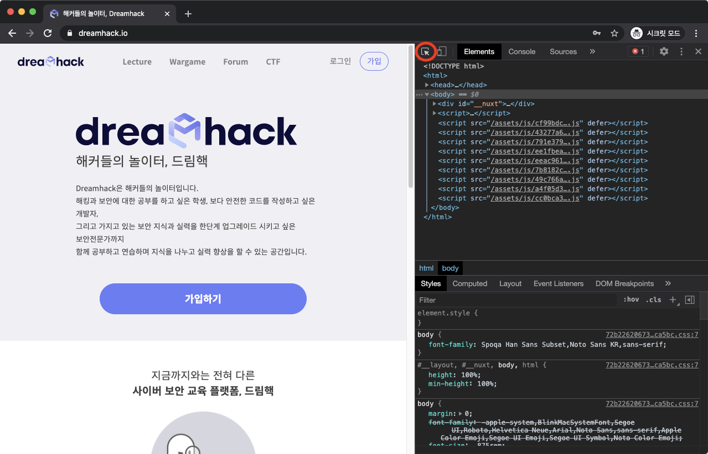
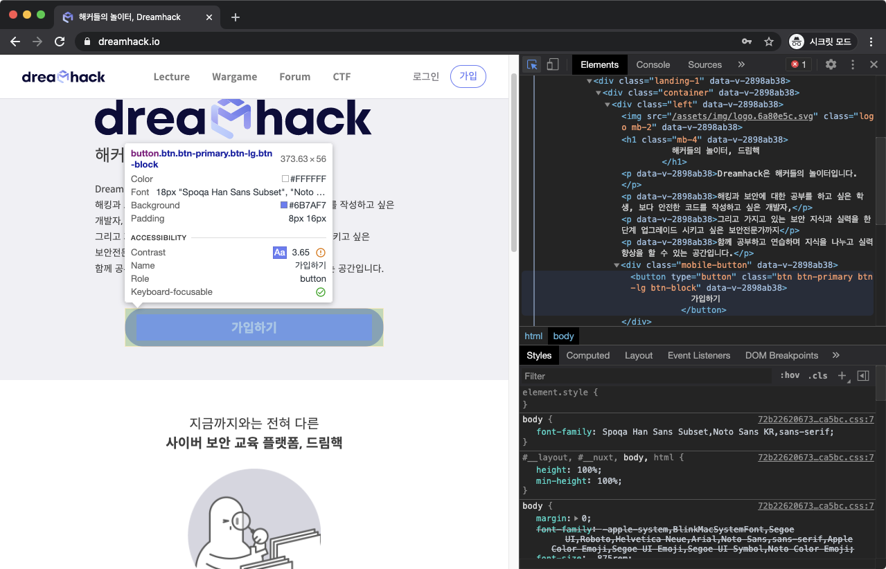

# Inspect

요소 검사를 활용하면 특정 요소의 개괄적인 정보를 파악하고, 이와 관련된 코드를 쉽게 찾을 수 있습니다.



### 요소 검사 도구 활성화

요소 검사 버튼을 누릅니다.



### 요소 확인

웹 페이지에서 원하는 요소에 마우스를 올리면 해당 요소의 정보가 출력됩니다.




### 코드 하이라이팅

정보가 출력된 상태에서 요소를 클릭하면, 그 요소와 관련된 HTML 코드가 하이라이팅됩니다.



