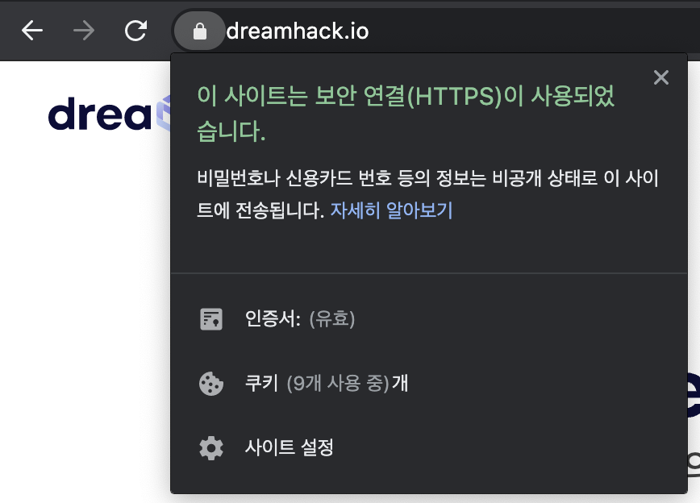
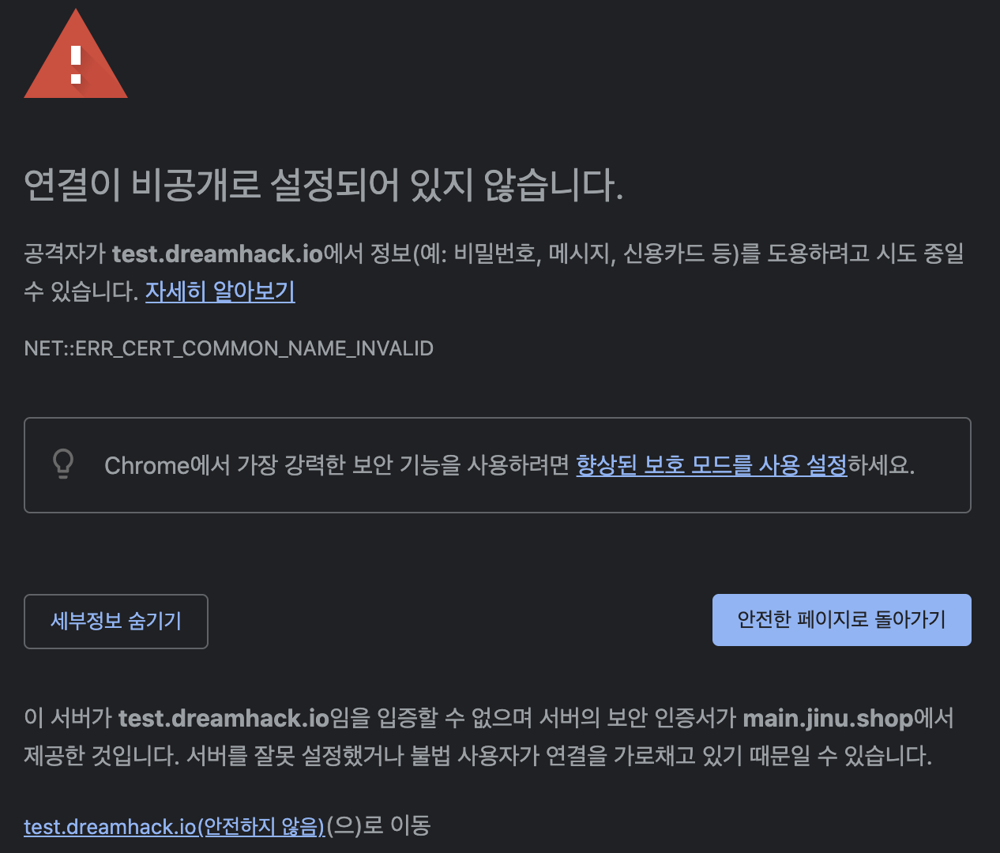

# WebBrowser

* 웹은 인터넷이라는 글로벌 네트워크 위에 구현되어 있으며, 정해진 프로토콜을 기반으로 통신한다.
* 일반 사용자가 규칙을 이해하지 않더라도 웹 서핑을 가능하도록 하는 것이 웹 브라우저다.
* 아래 그림은 이용자가 주소창에 dreamhack.io를 입력했을 때 웹 브라우저에서 일어나는 기본적인 동작을 나열한 것이다.



### 주소 해석

웹 브라우저의 주소창에 입력된 주소를 해석합니다 ([URL](/broken/pages/64a0f4555f176cb43774a7e16f65e83c8758be08) 분석).



### 도메인 탐색

dreamhack.io에 해당하는 주소를 탐색합니다 (DNS 요청).



### 요청 전송

HTTP를 통해 dreamhack.io에 요청을 보냅니다.



### 응답 수신

dreamhack.io의 HTTP 응답을 수신합니다.



### 리소스 다운로드 및 렌더링

리소스를 다운로드하고 웹을 렌더링합니다 (HTML, CSS, JavaScript).



| **안전한 인증서**                                                                                        | **안전하지 않은 인증서**                                                                                    |
| -------------------------------------------------------------------------------------------------- | -------------------------------------------------------------------------------------------------- |
|  |  |

<table data-view="cards"><thead><tr><th>Title</th><th data-card-target data-type="content-ref">Target</th></tr></thead><tbody><tr><td>Domain_name</td><td><a href="file:///0903665/network/Domain_name.md">file:///0903665/network/Domain_name.md</a></td></tr><tr><td>Web_rendering</td><td><a href="file:///0903665/security/Web_rendering.md">file:///0903665/security/Web_rendering.md</a></td></tr><tr><td>BrowserDevTools</td><td><a href="/broken/pages/e8f12b587187f8245e93a4e6f594ba06c624ea21">Broken link</a></td></tr></tbody></table>
