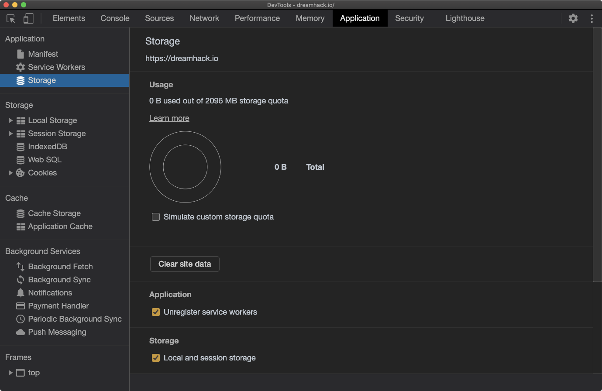
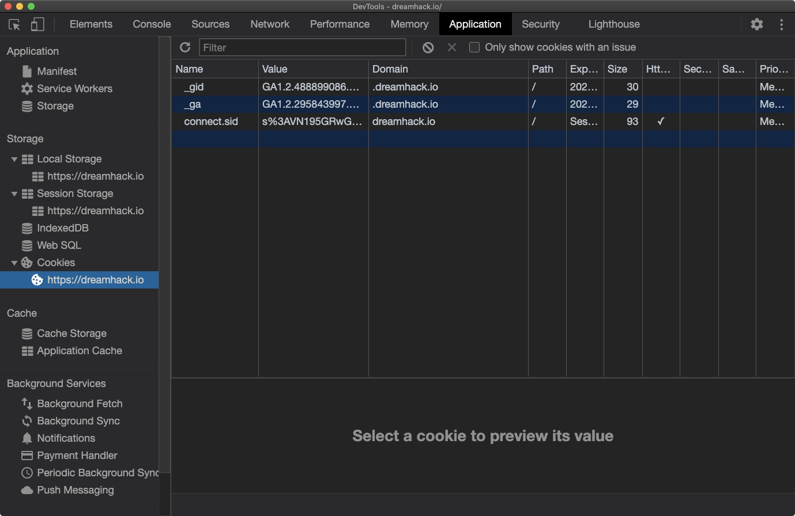

# DevTools\_ApplicationTab

### 리소스 조회

쿠키, 캐시, 이미지, 폰트, 스타일시트 등 웹 애플리케이션과 관련된 리소스를 조회할 수 있습니다.

### Cookies

Cookies에서는 브라우저에 저장된 쿠키 정보를 확인하고, 수정할 수 있습니다.


Cookies 탭을 통해 브라우저에 저장된 쿠키의 이름, 값, 도메인, 경로, 만료일 등을 확인하고 필요 시 값을 수정할 수 있습니다.

