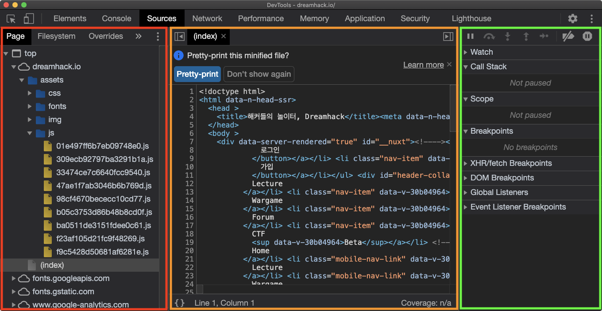

# WebDeveloperTools

## Web Developer Tools

웹 개발자 도구(Web Developer Tools, DevTools)는 웹 브라우저에 내장된 도구로, 웹 페이지의 구조, 스타일, 동작을 분석하고 디버깅하는 데 사용됩니다. 이를 통해 개발자는 웹 페이지의 문제를 식별하고 수정할 수 있습니다. 주요 기능으로는 HTML 및 CSS 편집, 자바스크립트 디버깅, 네트워크 활동 모니터링 등이 있습니다. 대표적인 웹 개발자 도구로는 구글 크롬의 DevTools, 모질라 파이어폭스의 개발자 도구, 마이크로소프트 엣지의 개발자 도구 등이 있습니다.

현재 페이지를 구성하는 웹 리소스들을 확인할 수 있습니다.

| 🔴 현재 페이지의 리소스 파일 트리, 파일 시스템                                                                                                                                                                                                                                                                                                                                                                      |
| ------------------------------------------------------------------------------------------------------------------------------------------------------------------------------------------------------------------------------------------------------------------------------------------------------------------------------------------------------------------------------------------------- |
| 🟠 선택한 리소스 상세 보기                                                                                                                                                                                                                                                                                                                                                                                  |
| 
🟢 디버깅 정보  - Watch: 원하는 자바스크립트 식을 입력하면, 코드 실행 과정에서 해당 식의 값 변화를 확인할 수 있습니다.  - Call Stack: 함수들의 호출 순서를 스택 형태로 보여줍니다. 예를 들어, <code>A → B → C</code> 순서로 함수가 호출되어 현재 <code>C</code> 내부의 코드를 실행하고 있다면, Call Stack의 가장 위에는 <code>C</code>, 가장 아래에는 <code>A</code>가 위치합니다.  - Scope: 정의된 모든 변수들의 값을 확인할 수 있습니다.  - Breakpoints: 브레이크포인트들을 확인하고, 각각을 활성화 또는 비활성화할 수 있습니다.
 |

***

## Debug

Source 탭에서는 원하는 자바스크립트를 디버깅할 수도 있습니다. 아래 코드는 이용자가 입력한 `name`, `num`에 따라 실행 흐름이 바뀌는 코드인데, 이를 다음과 같은 방법으로 디버깅할 수 있습니다.

👉 [실습 페이지 열기](https://dreamhack-lecture.s3.ap-northeast-2.amazonaws.com/uploads/web-devtools/debug.html)



### 브레이크포인트 설정

원하는 코드 라인을 클릭하여 해당 라인에 브레이크포인트를 설정합니다.



### 실행 및 중단

임의의 데이터를 입력하면 해당 브레이크포인트에서 실행이 멈춥니다.



### 변수 확인 및 변경

Scope에서 현재 할당된 변수들을 확인하고 값을 변경할 수 있습니다.


