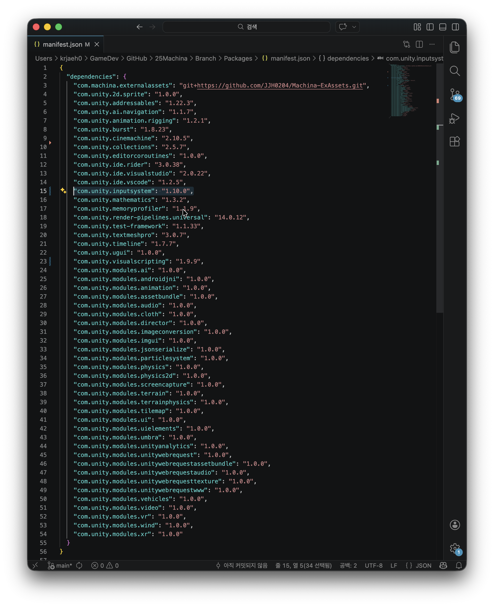

# InputSystem Error

프로젝트 진행을 잠시 멈춘 1\~2개월 동안 에디터로 열어보지 않았다가 마무리 작업을 위해 프로젝트를 열었는데 아래와 같은 에러 메시지가 나를 반겼다.

Library/PackageCache/com.unity.inputsystem@1.14.2/InputSystem/Actions/InputActionState.cs(50,46): error CS0246: The type or namespace name 'IInputStateChangeMonitor' could not be found (are you missing a using directive or an assembly reference?)

기존 라이브러리 폴더를 삭제하고 유니티 캐시를 삭제해보고 player 세팅을 수정하는 등 여러 방법을 사용해봤지만 가장 확실한 해결 방식은 버전을 낮추는 거였다... 내 2시간 돌려줘...

<figure><figcaption></figcaption></figure>

manifest.json 파일에서 inputsystem을 찾아서 버전을 임의로 내렸다.

알아보니 기존에 1.14.2버전은 유니티 6 에서 원활하게 동작한다고 하던데 언제 우리 프로젝트에 업데이트가 되었는지 모르겠지만 암튼 버전을 내려서 에디터를 실행하니 원활하게 동작했다.

다음에는 패키지 버전 관리도 신경 써야겠다. 무심코 누른 확인 버튼이 아까운 시간을 날린다는 교훈은 얻었다.
